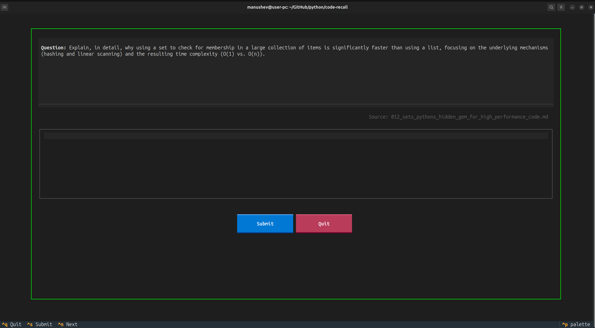
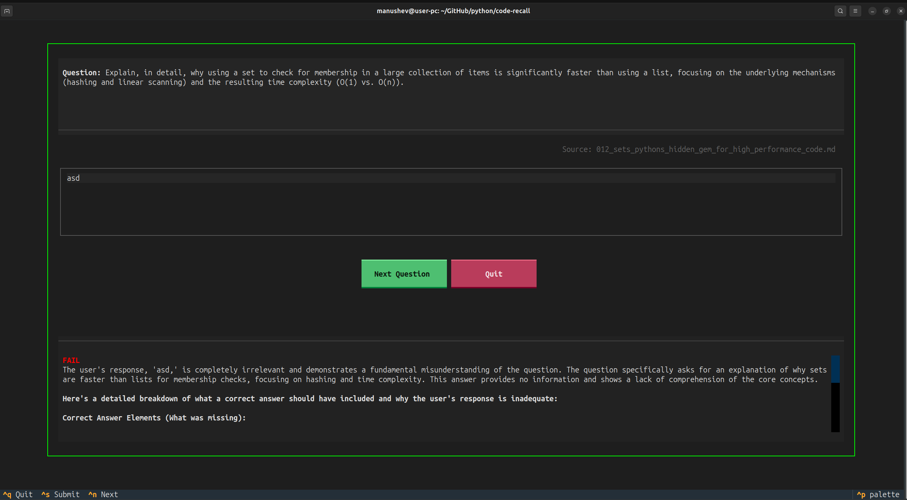

# 🧠 CodeRecall

CodeRecall is a lightweight, terminal-based flashcard app that uses local LLMs to help you retain knowledge from your markdown articles. No databases, no cloud, just you and your notes.


*Main interface with a question.*


*Main interface with question, answer and feedback.*

## 🚀 Features

- **TUI Power**: A sleek terminal interface built with [Textual](https://textual.textualize.io/).
- **Dual LLM Support**: Choose between [OpenAI](https://openai.com/) (default) or local [Ollama](https://ollama.ai/) models. Switch providers on-the-fly with `Ctrl+M`.
- **Stay Focused**: Designed to be triggered by an OS scheduler (like Cron) to keep your recall sessions consistent.
- **Deep Recall**: Not just multiple choice—type your answers and get strict technical feedback.
- **VRAM Optimized**: Explicitly unloads models on exit to keep your GPU ready for other tasks.

## 🛠 Setup

### 1. Prerequisites
- **Python 3.12+**
- **[uv](https://github.com/astral-sh/uv)** (Python package manager)
- **[OpenAI API Key](https://platform.openai.com/)** (for OpenAI provider) OR
- **[Ollama](https://ollama.ai/)** (for local models, installed and available in PATH)

### 2. Installation
Clone this repository and sync dependencies:

```bash
uv sync
```

### 3. Configuration
Copy the example environment file and customize it if needed:

```bash
cp .env.example .env
```

Open `.env` and adjust the variables:
- `ARTICLES_DIR`: The path to your markdown files (defaults to `./articles`).
- `DEFAULT_PROVIDER`: LLM provider to use - `openai` (default) or `ollama`.
- `OPENAI_API_KEY`: Your OpenAI API key (required for OpenAI provider).
- `OPENAI_MODEL_NAME`: The OpenAI model to use (defaults to `gpt-4.1-mini`).
- `MODEL_NAME`: The Ollama model to use (defaults to `gemma2:2b`).

### 4. Prepare Articles
Place your `.md` articles in the directory specified by `ARTICLES_DIR` in your `.env` file.

## 🎮 Usage

Run the app directly with `uv`:

```bash
uv run main.py
```

### Keyboard Shortcuts
| Key | Action |
|-----|--------|
| `Ctrl+S` | Submit Answer |
| `Ctrl+N` | Next Question |
| `Ctrl+T` | Toggle Provider |
| `Ctrl+Q` | Quit Application |

## ⚙️ How it Works

1. **Generation**: The app picks a random markdown file and asks the LLM (OpenAI or Ollama) to generate a conceptual question.
2. **Interaction**: You type your answer in the provided text area.
3. **Evaluation**: The LLM acts as a "Strict Technical Interviewer," grading your response as **PASS** or **FAIL** with feedback on missing concepts.
4. **Switch Providers**: Press `Ctrl+T` anytime to toggle between OpenAI and Ollama. The current provider is shown in the footer.

## 📝 Automation (Cron)

To run CodeRecall every 2 hours and have it pop up a terminal window:

1.  Make sure `recall.sh` has the correct paths.
2.  Open your crontab:
    ```bash
    crontab -e
    ```
3.  Add the following line (update the path to the script):
    ```bash
    0 */2 * * * /home/manushev/GitHub/python/code-recall/recall.sh
    ```

> [!NOTE]
> The `recall.sh` script sets `DISPLAY`, `XAUTHORITY`, and `DBUS_SESSION_BUS_ADDRESS`. You may need to update these in the script to match your local session (e.g., `echo $DISPLAY`). The script will automatically try to read the model name from your `.env` file to handle VRAM cleanup.

---
Created by [Tihomir Manushev](https://github.com/haraGADygyl).
