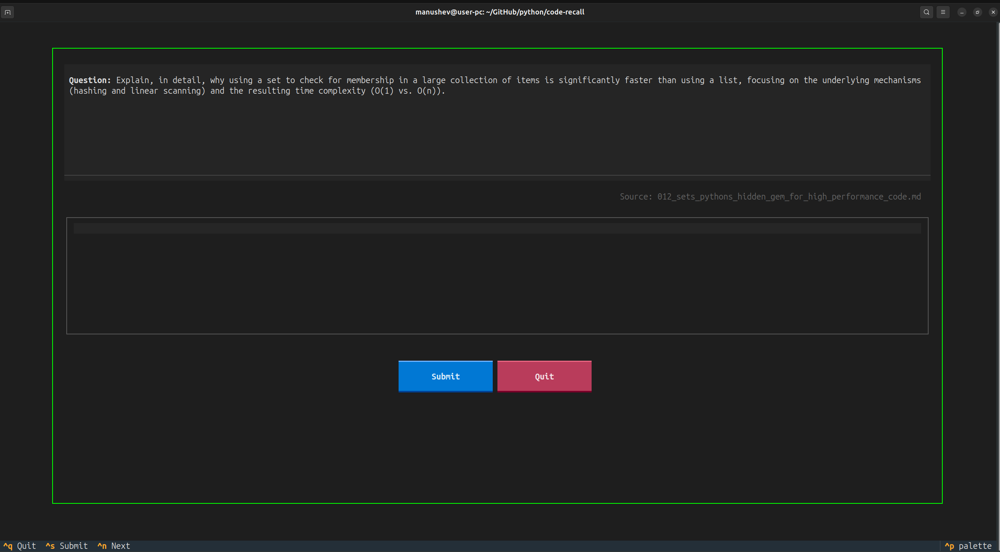
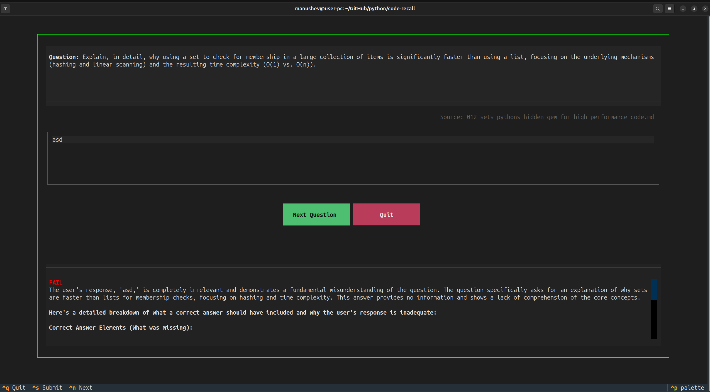

# 🧠 CodeRecall

CodeRecall is a lightweight, terminal-based flashcard app that uses OpenAI or local LLMs to create multiple-choice questions from technical topics and markdown articles.


*Main interface with a question.*


*Main interface with question, answer and feedback.*

## 🚀 Features

- **TUI Power**: A sleek terminal interface built with [Textual](https://textual.textualize.io/).
- **Dual LLM Support**: Choose between [OpenAI](https://openai.com/) (default) or local [Ollama](https://ollama.ai/) models. Switch providers on-the-fly with `Ctrl+T`.
- **Stay Focused**: Designed to be triggered by an OS scheduler (like Cron) to keep your recall sessions consistent.
- **Quick Recall**: Choose from four plausible answers and get an immediate explanation without typing.
- **VRAM Optimized**: The Cron launcher unloads the configured Ollama model after the app exits.

## 🛠 Setup

### 1. Prerequisites
- **Python 3.12+**
- **[uv](https://github.com/astral-sh/uv)** (Python package manager)
- **[OpenAI API Key](https://platform.openai.com/)** (for OpenAI provider) OR
- **[Ollama](https://ollama.ai/)** (for local models, installed and available in PATH)

### 2. Installation
Clone this repository and sync dependencies:

```bash
uv sync
```

### 3. Configuration
Copy the example environment file and customize it if needed:

```bash
cp .env.example .env
```

Open `.env` and adjust the variables:
- `ARTICLES_DIR`: The path to your markdown files (defaults to `./articles`).
- `DEFAULT_PROVIDER`: LLM provider to use - `openai` (default) or `ollama`.
- `OPENAI_API_KEY`: Your OpenAI API key (required for OpenAI provider).
- `OPENAI_MODEL_NAME`: The OpenAI model to use (defaults to `gpt-4.1-mini`).
- `MODEL_NAME`: The Ollama model to use (defaults to `gemma2:2b`).

### 4. Prepare Articles
Place your `.md` articles in the directory specified by `ARTICLES_DIR` in your `.env` file.

## 🎮 Usage

Run the app directly with `uv`:

```bash
uv run main.py
```

### Keyboard Shortcuts
| Key | Action |
|-----|--------|
| `Up` / `Down` | Select Answer |
| `Enter` | Submit Answer |
| `Ctrl+N` | Next Question |
| `Ctrl+T` | Toggle Provider |
| `Ctrl+R` | Toggle Question Mode |
| `Ctrl+Q` | Quit Application |

## ⚙️ How it Works

1. **Generation**: The app selects an article or technical topic and asks the LLM for one question, one correct answer, three distractors, and a rationale.
2. **Interaction**: Use the arrow keys to highlight an answer and press `Enter` to submit it.
3. **Evaluation**: The app checks the selected answer locally and immediately shows the correct answer and rationale.
4. **Switch Providers**: Press `Ctrl+T` anytime to toggle between OpenAI and Ollama. The question's provider is shown below its answers.

## 💬 Commit Convention

This project enforces [Conventional Commits](https://www.conventionalcommits.org/) with a **required scope** via a `commit-msg` pre-commit hook. All commit messages must follow the format:

```
type(scope): description
```

Install the hook after cloning:

```bash
uv run pre-commit install --hook-type commit-msg
```

## 📝 Automation (Cron)

To run CodeRecall every hour and have it pop up a terminal window:

1.  Make sure `recall.sh` has the correct paths.
2.  Open your crontab:
    ```bash
    crontab -e
    ```
3.  Add the following line (update the path to the script):
    ```bash
    0 * * * * /home/manushev/GitHub/python/code-recall/recall.sh
    ```

> [!NOTE]
> The `recall.sh` script reads the active graphical session environment from the user systemd manager so Cron can open GNOME Terminal on the current desktop. If no graphical session is available, the script records the error in `recall_error.log`. It also reads the model name from `.env` for VRAM cleanup.

---
Created by [Tihomir Manushev](https://github.com/haraGADygyl).
